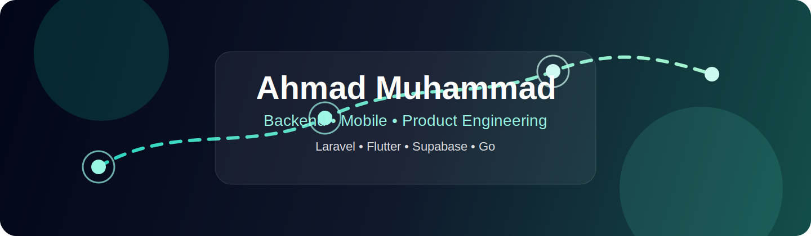

  

<h1 align="center">Ahmad Muhammad</h1>

  Backend-focused developer building secure web apps, practical APIs, and polished products with Laravel, Flutter, and modern web tools.

  
  
  
  

  

## What I build

I like products where the front end feels calm and the backend has real bones: secure APIs, database-backed systems, dashboards, mobile apps, and tools that reduce friction for people using them.

Right now I am especially interested in:

- backend architecture with **PHP / Laravel**
- mobile and cross-platform product work with **Flutter**
- database-backed systems using **MySQL, PostgreSQL, and Supabase**
- developer tooling with **Go, Docker, GitHub, and Linux**

## Featured work

| Project | What it is |
| --- | --- |
| [`find`](https://github.com/emberrenewed/find) | Kurdish Sorani, RTL-first Flutter app for lost, stolen, and found items with Supabase auth, messaging, and moderation |
| [`repoready-cli`](https://github.com/emberrenewed/repoready-cli) | Go CLI project focused on preparing repositories for cleaner public release workflows |
| [`dockerreference`](https://github.com/emberrenewed/dockerreference) | Docker reference project for learning and practical lookup |
| [`passkey-api-laravel`](https://github.com/emberrenewed/passkey-api-laravel) | Laravel API work exploring modern authentication patterns |

## Toolbelt

  

| Area | Tools |
| --- | --- |
| Frontend | HTML, CSS, JavaScript, Tailwind CSS, React |
| Backend | PHP, Laravel, Go, Python |
| Mobile | Dart, Flutter |
| Data | MySQL, PostgreSQL, Supabase |
| Workflow | Docker, Postman, Linux, Git, GitHub |

## GitHub snapshot

  

  
  

## How I like to work

- build the smallest useful version first
- keep code readable enough that future-me can still trust it
- make security and deployment part of the design, not an afterthought
- leave projects cleaner than I found them

  
  

